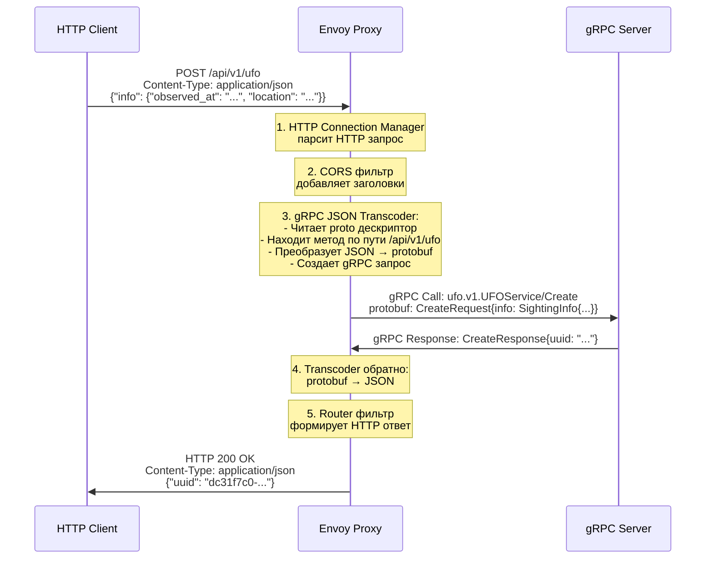

# UFO Sightings API - gRPC с HTTP-to-gRPC Transcoding через Envoy

Этот проект демонстрирует современную микросервисную архитектуру, где gRPC сервис для управления наблюдениями НЛО предоставляет REST API через Envoy Proxy с использованием HTTP-to-gRPC transcoding.

## 🏗️ Архитектура

```
HTTP Client → Envoy Proxy (HTTP-to-gRPC Transcoding) → gRPC Server
     ↑                                                      ↓
     ←─────────── HTTP/JSON Response ←─── gRPC Response ────┘
```

### Компоненты системы:

1. **gRPC Server** - Основной сервис для работы с наблюдениями НЛО
2. **Envoy Proxy** - Принимает HTTP запросы и преобразует их в gRPC
3. **HTTP Client** - Тестовый клиент для демонстрации REST API

## 🔄 Поток обработки запросов

### Детальный флоу HTTP-to-gRPC транскодинга:



### 1. HTTP запрос попадает в Envoy (порт 8080)

```
POST /api/v1/ufo HTTP/1.1
Host: localhost:8080
Content-Type: application/json

{
  "info": {
    "observed_at": "2025-01-01T00:00:00Z",
    "location": "Area 51",
    "description": "Bright object"
  }
}
```

### 2. Обработка в Envoy HTTP фильтрах (по порядку):

#### a) **HTTP Connection Manager**
- Парсит HTTP запрос
- Применяет маршрутизацию из `route_config`
- Определяет, что запрос должен идти в `ufo_grpc_cluster`

#### b) **CORS фильтр**
```yaml
- name: envoy.filters.http.cors
  typed_config:
    "@type": type.googleapis.com/envoy.extensions.filters.http.cors.v3.Cors
```
- Добавляет CORS заголовки для веб-приложений
- Обрабатывает preflight OPTIONS запросы

#### c) **gRPC JSON Transcoder фильтр** (ключевой компонент)
```yaml
- name: envoy.filters.http.grpc_json_transcoder
  typed_config:
    "@type": type.googleapis.com/envoy.extensions.filters.http.grpc_json_transcoder.v3.GrpcJsonTranscoder
    
    # Путь к скомпилированному proto дескриптору
    proto_descriptor: "/etc/envoy/ufo_descriptor.pb"
    
    # Список gRPC сервисов для транскодинга
    services: ["ufo.v1.UFOService"]
    
    # ⚠️ КЛЮЧЕВАЯ НАСТРОЙКА: Сопоставление по входящему маршруту
    match_incoming_request_route: true
    
    print_options:
      add_whitespace: true
      always_print_primitive_fields: true
      always_print_enums_as_ints: false
      preserve_proto_field_names: true
```

**Что делает transcoder:**

1. **Читает proto дескриптор** `/etc/envoy/ufo_descriptor.pb`
2. **Ищет соответствие HTTP → gRPC:**
   - `POST /api/v1/ufo` → `ufo.v1.UFOService/Create`
   - `GET /api/v1/ufo/{uuid}` → `ufo.v1.UFOService/Get`
   - `PUT /api/v1/ufo/{uuid}` → `ufo.v1.UFOService/Update`
   - `DELETE /api/v1/ufo/{uuid}` → `ufo.v1.UFOService/Delete`

3. **Преобразует данные:**
   ```
   JSON Request Body → protobuf CreateRequest
   HTTP Path Parameters → protobuf поля (например, {uuid} → request.uuid)
   HTTP Headers → gRPC Metadata
   ```

4. **Создает gRPC запрос:**
   ```
   Method: ufo.v1.UFOService/Create
   Message: CreateRequest {
     info: SightingInfo {
       observed_at: timestamp "2025-01-01T00:00:00Z"
       location: "Area 51"
       description: "Bright object"
     }
   }
   ```

#### d) **Router фильтр**
- Определяет upstream кластер: `ufo_grpc_cluster`
- Отправляет gRPC запрос на gRPC сервер

### 3. Обработка в gRPC кластере

```yaml
clusters:
- name: ufo_grpc_cluster
  type: STRICT_DNS
  lb_policy: ROUND_ROBIN
  
  # ⚠️ HTTP/2 обязательно для gRPC
  typed_extension_protocol_options:
    envoy.extensions.upstreams.http.v3.HttpProtocolOptions:
      "@type": type.googleapis.com/envoy.extensions.upstreams.http.v3.HttpProtocolOptions
      explicit_http_config:
        http2_protocol_options: {}
  
  # Health checks для gRPC
  health_checks:
  - grpc_health_check:
      service_name: "ufo.v1.UFOService"
  
  load_assignment:
    endpoints:
    - lb_endpoints:
      - endpoint:
          address:
            socket_address:
              address: ufo-grpc-server  # Docker service name
              port_value: 50051
```

### 4. Обработка в gRPC сервере

```go
// В cmd/grpc_server/main.go
func (s *ufoService) Create(ctx context.Context, req *ufoV1.CreateRequest) (*ufoV1.CreateResponse, error) {
    // Обработка protobuf сообщения
    uuid := generateUUID()
    sighting := &ufoV1.Sighting{
        Uuid: uuid,
        Info: req.GetInfo(), // SightingInfo из запроса
        CreatedAt: timestamppb.New(time.Now()),
    }
    
    s.sightings[uuid] = sighting
    
    return &ufoV1.CreateResponse{Uuid: uuid}, nil
}
```

### 5. Обратное преобразование gRPC → HTTP

**Transcoder получает gRPC ответ:**
```protobuf
CreateResponse {
  uuid: "dc31f7c0-b736-406f-b328-76f270764959"
}
```

**Преобразует в JSON:**
```json
{
  "uuid": "dc31f7c0-b736-406f-b328-76f270764959"
}
```

**Формирует HTTP ответ:**
```
HTTP/1.1 200 OK
Content-Type: application/json
Content-Length: 52

{
  "uuid": "dc31f7c0-b736-406f-b328-76f270764959"
}
```

## 📁 Структура проекта

```
.
├── cmd/
│   ├── grpc_client/     # gRPC клиент для прямого тестирования
│   ├── grpc_server/     # gRPC сервер (основной сервис)
│   └── http_client/     # HTTP клиент для тестирования REST API
├── pkg/proto/           # Сгенерированные Go файлы из proto
│   └── ufo/v1/
│       ├── ufo.pb.go           # Protobuf структуры
│       ├── ufo_grpc.pb.go      # gRPC код
│       └── ufo_descriptor.pb   # ⚠️ Бинарный дескриптор для Envoy
├── proto/               # Proto определения с HTTP аннотациями
│   ├── buf.yaml         # Конфигурация buf
│   ├── buf.gen.yaml     # Генерирование кода
│   └── ufo/v1/ufo.proto # Основной proto файл
├── docker-compose.yml   # Композиция сервисов
├── Dockerfile          # Dockerfile для gRPC сервера
├── envoy.yaml          # ⚠️ Ключевая конфигурация Envoy proxy
└── README.md
```

## 🔧 Ключевые конфигурационные файлы

### 1. Proto файл с HTTP аннотациями (`proto/ufo/v1/ufo.proto`)

```protobuf
syntax = "proto3";
package ufo.v1;

import "google/api/annotations.proto";  // ⚠️ Обязательно для HTTP аннотаций

service UFOService {
  // HTTP аннотации определяют маппинг HTTP → gRPC
  rpc Create(CreateRequest) returns (CreateResponse) {
    option (google.api.http) = {
      post: "/api/v1/ufo"    // HTTP POST /api/v1/ufo
      body: "*"              // Весь JSON body → CreateRequest
    };
  }
  
  rpc Get(GetRequest) returns (GetResponse) {
    option (google.api.http) = {
      get: "/api/v1/ufo/{uuid}"  // {uuid} из URL → GetRequest.uuid
    };
  }
  
  rpc Update(UpdateRequest) returns (google.protobuf.Empty) {
    option (google.api.http) = {
      put: "/api/v1/ufo/{uuid}"
      body: "*"
    };
  }
  
  rpc Delete(DeleteRequest) returns (google.protobuf.Empty) {
    option (google.api.http) = {
      delete: "/api/v1/ufo/{uuid}"
    };
  }
}
```

### 2. Генерация proto дескриптора

**⚠️ Критически важно:** Дескриптор должен включать HTTP аннотации из googleapis:

```bash
# В proto/ директории
buf build --as-file-descriptor-set --output "../pkg/proto/ufo/v1/ufo_descriptor.pb"
```

**Зависимости в `proto/buf.yaml`:**
```yaml
version: v2
deps:
  - buf.build/googleapis/googleapis  # ⚠️ Обязательно для HTTP аннотаций
```

### 3. Конфигурация Envoy (`envoy.yaml`)

#### Listener Configuration:
```yaml
static_resources:
  listeners:
  - name: ufo_api_listener
    address:
      socket_address:
        address: 0.0.0.0
        port_value: 8080  # HTTP API порт
    
    filter_chains:
    - filters:
      - name: envoy.filters.network.http_connection_manager
        typed_config:
          # Маршрутизация
          route_config:
            virtual_hosts:
            - domains: ["*"]
              routes:
              # ⚠️ Маршрут для API - должен совпадать с HTTP аннотациями
              - match:
                  prefix: "/api/v1/ufo"
                route:
                  cluster: ufo_grpc_cluster
                  timeout: 30s
              
              # Fallback маршрут
              - match:
                  prefix: "/"
                direct_response:
                  status: 404
                  body:
                    inline_string: |
                      {
                        "error": "Not Found",
                        "message": "Available endpoints: /api/v1/ufo"
                      }
```

#### HTTP Filters Chain:
```yaml
          http_filters:
          # 1. CORS фильтр
          - name: envoy.filters.http.cors
            typed_config:
              "@type": type.googleapis.com/envoy.extensions.filters.http.cors.v3.Cors
          
          # 2. ⚠️ gRPC JSON Transcoder - КЛЮЧЕВОЙ ФИЛЬТР
          - name: envoy.filters.http.grpc_json_transcoder
            typed_config:
              "@type": type.googleapis.com/envoy.extensions.filters.http.grpc_json_transcoder.v3.GrpcJsonTranscoder
              
              # Путь к proto дескриптору в контейнере
              proto_descriptor: "/etc/envoy/ufo_descriptor.pb"
              
              # Сервисы для транскодинга
              services: ["ufo.v1.UFOService"]
              
              # ⚠️ КРИТИЧНО: Использовать входящие маршруты для сопоставления
              match_incoming_request_route: true
              
              # Настройки JSON форматирования
              print_options:
                add_whitespace: true
                always_print_primitive_fields: true
                always_print_enums_as_ints: false
                preserve_proto_field_names: true
              
              ignore_unknown_query_parameters: true
          
          # 3. Router фильтр - ОБЯЗАТЕЛЬНО последний
          - name: envoy.filters.http.router
            typed_config:
              "@type": type.googleapis.com/envoy.extensions.filters.http.router.v3.Router
```

#### gRPC Cluster Configuration:
```yaml
  clusters:
  - name: ufo_grpc_cluster
    type: STRICT_DNS
    lb_policy: ROUND_ROBIN
    
    # ⚠️ HTTP/2 обязательно для gRPC
    typed_extension_protocol_options:
      envoy.extensions.upstreams.http.v3.HttpProtocolOptions:
        "@type": type.googleapis.com/envoy.extensions.upstreams.http.v3.HttpProtocolOptions
        explicit_http_config:
          http2_protocol_options: {}
    
    # Health checks для gRPC
    health_checks:
    - timeout: 3s
      interval: 10s
      grpc_health_check:
        service_name: "ufo.v1.UFOService"
    
    load_assignment:
      endpoints:
      - lb_endpoints:
        - endpoint:
            address:
              socket_address:
                address: ufo-grpc-server  # Docker service name
                port_value: 50051
```

### 4. Docker Compose с правильным монтированием

```yaml
services:
  ufo-grpc-server:
    build: .
    healthcheck:
      test: ["CMD", "grpc-health-probe", "-addr=localhost:50051"]
      interval: 10s
      timeout: 5s
      retries: 3
  
  envoy:
    image: envoyproxy/envoy:v1.34.0
    depends_on:
      ufo-grpc-server:
        condition: service_healthy
    
    volumes:
      - ./envoy.yaml:/etc/envoy/envoy.yaml
      # ⚠️ Монтирование дескриптора в контейнер
      - ./pkg/proto/ufo/v1/ufo_descriptor.pb:/etc/envoy/ufo_descriptor.pb
    
    ports:
      - "${ENVOY_PORT}:8080"      # HTTP API
      - "${ENVOY_ADMIN_PORT}:8081" # Admin interface
```

## 🚀 Быстрый старт

### Запуск с Docker Compose (рекомендуется)

1. **Генерация proto дескриптора:**
```bash
task proto:gen
# Или вручную:
cd proto && ../bin/buf build --as-file-descriptor-set --output "../pkg/proto/ufo/v1/ufo_descriptor.pb"
```

2. **Запуск всех сервисов:**
```bash
docker-compose up -d
```

3. **Проверка статуса сервисов:**
```bash
docker-compose ps
# Все сервисы должны быть (healthy)
```

4. **Тестирование REST API:**

**Создание наблюдения:**
```bash
curl -X POST http://localhost:8080/api/v1/ufo \
  -H "Content-Type: application/json" \
  -d '{
    "info": {
      "observed_at": "2024-01-15T14:30:00Z",
      "location": "Area 51, Nevada",
      "description": "Bright circular object moving at high speed",
      "color": "silver",
      "sound": true,
      "duration_seconds": 120
    }
  }'

# Ответ: {"uuid": "dc31f7c0-b736-406f-b328-76f270764959"}
```

**Получение наблюдения:**
```bash
curl http://localhost:8080/api/v1/ufo/dc31f7c0-b736-406f-b328-76f270764959
```

**Обновление:**
```bash
curl -X PUT http://localhost:8080/api/v1/ufo/dc31f7c0-b736-406f-b328-76f270764959 \
  -H "Content-Type: application/json" \
  -d '{
    "update_info": {
      "location": "Roswell, New Mexico",
      "description": "Updated description with more details",
      "color": "blue"
    }
  }'
```

**Удаление (мягкое):**
```bash
curl -X DELETE http://localhost:8080/api/v1/ufo/dc31f7c0-b736-406f-b328-76f270764959
```

5. **Запуск полного HTTP клиента:**
```bash
go run cmd/http_client/main.go
```

## 📋 API Reference

### REST API Endpoints (через Envoy)

| HTTP Method | Endpoint | gRPC Method | Request Body | Response | Описание |
|-------------|----------|-------------|--------------|----------|----------|
| `POST` | `/api/v1/ufo` | `Create` | `{"info": SightingInfo}` | `{"uuid": "..."}` | Создание нового наблюдения НЛО |
| `GET` | `/api/v1/ufo/{uuid}` | `Get` | - | `{"sighting": Sighting}` | Получение наблюдения по UUID |
| `PUT` | `/api/v1/ufo/{uuid}` | `Update` | `{"update_info": SightingUpdateInfo}` | `{}` | Обновление существующего наблюдения |
| `DELETE` | `/api/v1/ufo/{uuid}` | `Delete` | - | `{}` | Мягкое удаление наблюдения |

### Структуры данных

**SightingInfo (для создания):**
```json
{
  "observed_at": "2024-01-15T14:30:00Z",     // RFC3339 формат (обязательно)
  "location": "Area 51, Nevada",             // Место наблюдения (обязательно)
  "description": "Bright circular object",   // Описание объекта (обязательно)
  "color": "silver",                         // Цвет (опционально)
  "sound": true,                             // Звук (опционально)
  "duration_seconds": 120                    // Длительность в секундах (опционально)
}
```

**SightingUpdateInfo (для обновления - все поля опциональны):**
```json
{
  "observed_at": "2024-01-15T14:30:00Z",
  "location": "Roswell, New Mexico",
  "description": "Updated description",
  "color": "blue",
  "sound": false,
  "duration_seconds": 180
}
```

**Sighting (полная структура ответа):**
```json
{
  "uuid": "dc31f7c0-b736-406f-b328-76f270764959",
  "info": {
    "observed_at": "2024-01-15T14:30:00Z",
    "location": "Area 51, Nevada", 
    "description": "Bright circular object",
    "color": "silver",
    "sound": true,
    "duration_seconds": 120
  },
  "created_at": "2024-01-15T14:30:15.123Z",
  "updated_at": "2024-01-15T14:35:20.456Z",
  "deleted_at": "2024-01-15T14:40:10.789Z"   // Для мягкого удаления
}
```

## 🔧 Конфигурация

### Переменные окружения (.env)

```bash
# Порты для Envoy
ENVOY_PORT=8080              # HTTP API порт (default: 8080)
ENVOY_ADMIN_PORT=8081        # Envoy admin интерфейс (default: 8081)
```

### Envoy Proxy эндпоинты

- **HTTP API**: `http://localhost:8080/api/v1/ufo`
- **Admin UI**: `http://localhost:8081`
- **Health Check**: `http://localhost:8081/ready`
- **Metrics**: `http://localhost:8081/stats`
- **Config Dump**: `http://localhost:8081/config_dump`

## 📊 Мониторинг и отладка

### Health Checks

```bash
# Проверка готовности Envoy
curl http://localhost:8081/ready
# Ожидаемый ответ: LIVE

# Проверка gRPC сервера через Docker
docker exec ufo-grpc-server /bin/grpc-health-probe -addr=localhost:50051
# Ожидаемый ответ: status: SERVING
```

### Логи

```bash
# Просмотр логов всех сервисов
docker-compose logs -f

# Логи конкретного сервиса
docker-compose logs -f envoy
docker-compose logs -f ufo-grpc-server

# Логи с фильтрацией
docker-compose logs envoy | grep transcoder
```

### Debug конфигурации Envoy

```bash
# Полная конфигурация Envoy
curl -s http://localhost:8081/config_dump | jq

# Статистика транскодера
curl -s http://localhost:8081/stats | grep grpc_json_transcoder

# Статистика кластера
curl -s http://localhost:8081/stats | grep ufo_grpc_cluster
```

### Частые проблемы и решения

#### 1. **404 Not Found при запросах к API**

**Причина:** Transcoder не может найти соответствие HTTP → gRPC

**Решение:**
```bash
# Проверить, что дескриптор содержит HTTP аннотации
ls -la pkg/proto/ufo/v1/ufo_descriptor.pb

# Пересоздать дескриптор
cd proto && ../bin/buf build --as-file-descriptor-set --output "../pkg/proto/ufo/v1/ufo_descriptor.pb"

# Перезапустить Envoy
docker-compose restart envoy
```

#### 2. **Контейнер ufo-grpc-server unhealthy**

**Причина:** Отсутствует health check service в gRPC сервере

**Проверка:**
```bash
docker-compose logs ufo-grpc-server
docker exec ufo-grpc-server /bin/grpc-health-probe -addr=localhost:50051
```

#### 3. **Envoy не может подключиться к gRPC серверу**

**Проверка сети Docker:**
```bash
docker-compose ps
docker network ls
docker exec envoy nslookup ufo-grpc-server
```

#### 4. **Ошибки формата JSON в запросах**

**Правильная структура для POST:**
```json
{
  "info": {  // ⚠️ Обязательно обернуть в "info"
    "observed_at": "2024-01-15T14:30:00Z",
    "location": "Test",
    "description": "Test"
  }
}
```

**Правильная структура для PUT:**
```json
{
  "update_info": {  // ⚠️ Обязательно обернуть в "update_info"
    "location": "Updated location"
  }
}
```

## 🛠️ Разработка

### Требования

- Go 1.24+
- Docker & Docker Compose
- [Buf CLI](https://buf.build/docs/installation) для работы с proto файлами
- [Task](https://taskfile.dev/) для автоматизации (опционально)

### Workflow разработки

1. **Изменение proto файлов:**
```bash
# Редактировать proto/ufo/v1/ufo.proto
vim proto/ufo/v1/ufo.proto

# Регенерировать код и дескриптор
task proto:gen
# Или вручную:
cd proto && buf generate && buf build --as-file-descriptor-set --output "../pkg/proto/ufo/v1/ufo_descriptor.pb"
```

2. **Изменение gRPC сервера:**
```bash
# Редактировать cmd/grpc_server/main.go
# Пересобрать и перезапустить
docker-compose up --build -d ufo-grpc-server
```

3. **Изменение конфигурации Envoy:**
```bash
# Редактировать envoy.yaml  
# Перезапустить только Envoy
docker-compose restart envoy
```

### Локальная разработка без Docker

1. **Запуск gRPC сервера:**
```bash
go run cmd/grpc_server/main.go
# Слушает на localhost:50051
```

2. **Запуск Envoy с локальным gRPC сервером:**
```bash
# Изменить в envoy.yaml:
# address: ufo-grpc-server → address: host.docker.internal
# Или address: 172.17.0.1 (IP Docker bridge)

docker run --rm -p 8080:8080 -p 8081:8081 \
  -v $(pwd)/envoy.yaml:/etc/envoy/envoy.yaml \
  -v $(pwd)/pkg/proto/ufo/v1/ufo_descriptor.pb:/etc/envoy/ufo_descriptor.pb \
  envoyproxy/envoy:v1.34.0
```

## 📈 Преимущества данной архитектуры

### 1. **Единый контракт API**
- Proto файл является источником истины для gRPC и REST API
- Автоматическая генерация клиентов для разных языков
- Строгая типизация и валидация данных

### 2. **Производительность**
- gRPC с protobuf для внутренней связи (быстрее JSON)
- HTTP/2 multiplexing в gRPC
- Эффективная сериализация

### 3. **Совместимость**
- REST API для веб-клиентов и legacy систем  
- gRPC для производительных клиентов
- Прозрачное преобразование между форматами

### 4. **Операционные преимущества**
- Централизованный Envoy как единая точка входа
- Мониторинг, логирование, rate limiting в одном месте
- Health checks и service discovery
- Автоматический retry и circuit breaking

### 5. **Безопасность**
- TLS termination в Envoy
- Централизованная аутентификация и авторизация
- CORS поддержка для веб-приложений

## 🔧 Дополнительные возможности

### Rate Limiting

Добавить в `envoy.yaml` фильтр rate limiting:

```yaml
http_filters:
- name: envoy.filters.http.local_ratelimit
  typed_config:
    "@type": type.googleapis.com/udpa.type.v1.TypedStruct
    type_url: type.googleapis.com/envoy.extensions.filters.http.local_ratelimit.v3.LocalRateLimit
    value:
      stat_prefix: http_local_rate_limiter
      token_bucket:
        max_tokens: 100
        tokens_per_fill: 100
        fill_interval: 60s
      filter_enabled:
        runtime_key: local_rate_limit_enabled
        default_value:
          numerator: 100
          denominator: HUNDRED
      filter_enforced:
        runtime_key: local_rate_limit_enforced
        default_value:
          numerator: 100
          denominator: HUNDRED
```

### TLS/HTTPS

Для production окружения добавить TLS:

```yaml
listeners:
- name: ufo_api_listener_https
  address:
    socket_address:
      address: 0.0.0.0
      port_value: 8443
  filter_chains:
  - transport_socket:
      name: envoy.transport_sockets.tls
      typed_config:
        "@type": type.googleapis.com/envoy.extensions.transport_sockets.tls.v3.DownstreamTlsContext
        common_tls_context:
          tls_certificates:
          - certificate_chain:
              filename: "/etc/ssl/certs/server.crt"
            private_key:
              filename: "/etc/ssl/private/server.key"
```

### Metrics и Tracing

Подключение к Prometheus и Jaeger:

```yaml
admin:
  address:
    socket_address:
      address: 0.0.0.0
      port_value: 8081
  
tracing:
  http:
    name: envoy.tracers.jaeger
    typed_config:
      "@type": type.googleapis.com/envoy.config.trace.v3.JaegerConfig
      collector_cluster: jaeger
      collector_endpoint: "/api/traces"

stats_sinks:
- name: envoy.stat_sinks.metrics_service
  typed_config:
    "@type": type.googleapis.com/envoy.config.metrics.v3.MetricsServiceConfig
    transport_api_version: V3
    grpc_service:
      envoy_grpc:
        cluster_name: metrics-service
```

## 📚 Дополнительные ресурсы

### Документация
- [Envoy Proxy Documentation](https://www.envoyproxy.io/docs)
- [gRPC-JSON Transcoder Filter](https://www.envoyproxy.io/docs/envoy/latest/configuration/http/http_filters/grpc_json_transcoder_filter)
- [Protocol Buffers Language Guide](https://developers.google.com/protocol-buffers/docs/proto3)
- [Google API Design Guide](https://cloud.google.com/apis/design)
- [HTTP API Annotations](https://github.com/googleapis/googleapis/blob/master/google/api/http.proto)

### Инструменты
- [Buf CLI](https://buf.build/docs) - Современный инструмент для работы с protobuf
- [grpcurl](https://github.com/fullstorydev/grpcurl) - curl для gRPC
- [Evans](https://github.com/ktr0731/evans) - gRPC клиент с интерактивным режимом
- [Postman](https://www.postman.com/) - Поддержка gRPC и REST API

### Альтернативы
- [gRPC-Gateway](https://grpc-ecosystem.github.io/grpc-gateway/) - Альтернативный подход к HTTP-gRPC transcoding
- [Istio](https://istio.io/) - Service mesh с возможностями Envoy
- [Kong](https://konghq.com/) - API Gateway с поддержкой gRPC
- [Ambassador](https://www.getambassador.io/) - Kubernetes-native API Gateway
