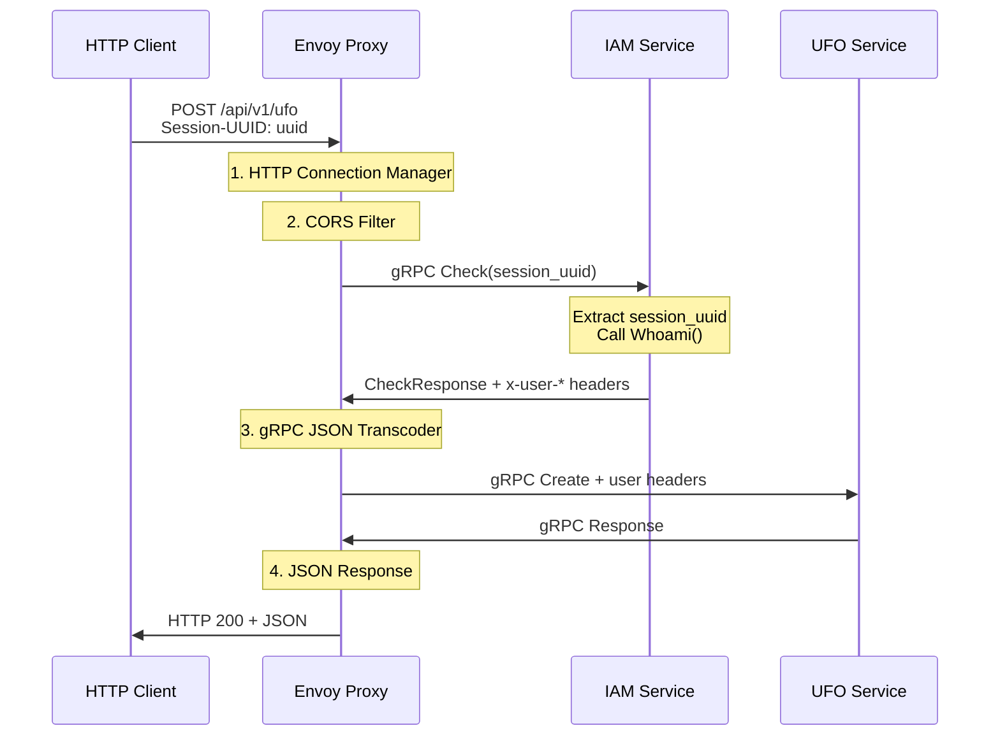

# UFO Sightings API с IAM аутентификацией через Envoy

Этот проект демонстрирует современную микросервисную архитектуру с централизованной аутентификацией через API Gateway (Envoy Proxy). Система состоит из двух gRPC сервисов и Envoy, который обеспечивает HTTP-to-gRPC transcoding и External Authorization.

## 🏗️ Архитектура системы

```
HTTP Client → Envoy Proxy → IAM Service (External Auth) → UFO Service
     ↑              ↓              ↓
     ←── JSON ───────┘         (session validation)
```

### Компоненты:

1. **UFO gRPC Service** (порт 50051) - Основной бизнес-сервис для управления наблюдениями НЛО
2. **IAM gRPC Service** (порт 50052) - Сервис аутентификации с двумя интерфейсами:
   - `Whoami` - основной API для проверки сессий
   - `Check` - External Authorization для Envoy
3. **Envoy Proxy** (порт 8080/8081) - API Gateway с HTTP-to-gRPC transcoding и аутентификацией

## 🔄 Поток обработки запроса



## 🚀 Быстрый старт

### 1. Генерация proto файлов
```bash
task proto:gen
```

### 2. Запуск всех сервисов
```bash
task dev:start
```

### 3. Проверка статуса
```bash
task docker:ps
```

Все сервисы должны быть `healthy`.

### 4. Тестирование API

**Через заголовок Session-UUID:**
```bash
task test:auth:header
```

**Через Authorization Bearer:**
```bash
task test:auth:bearer
```

**Через Cookie:**
```bash
task test:auth:cookie
```

**Без аутентификации (должно упасть):**
```bash
task test:auth:fail
```

## 🔐 Аутентификация

Система поддерживает 4 способа передачи `session_uuid`:

### 1. Кастомный заголовок (рекомендуется)
```bash
curl -H "Session-UUID: any-uuid-here" POST /api/v1/ufo
```

### 2. Альтернативный заголовок
```bash
curl -H "X-Session-ID: any-uuid-here" POST /api/v1/ufo
```

### 3. Authorization Bearer
```bash
curl -H "Authorization: Bearer any-uuid-here" POST /api/v1/ufo
```

### 4. Cookie
```bash
curl -H "Cookie: session_uuid=any-uuid-here" POST /api/v1/ufo
```

> **Заглушка:** В данной демо-версии любой UUID принимается как валидная сессия и возвращает захардкоженного тестового пользователя.

## 📋 API Reference

### REST API Endpoints (через Envoy)

| Method | Endpoint | Description | Authentication |
|--------|----------|-------------|----------------|
| `POST` | `/api/v1/ufo` | Создать наблюдение НЛО | ✅ Требуется |
| `GET` | `/api/v1/ufo/{uuid}` | Получить наблюдение по UUID | ✅ Требуется |
| `PUT` | `/api/v1/ufo/{uuid}` | Обновить наблюдение | ✅ Требуется |
| `DELETE` | `/api/v1/ufo/{uuid}` | Удалить наблюдение | ✅ Требуется |
| `GET` | `/health` | Health check | ❌ Не требуется |

### Пример запроса

```bash
curl -X POST http://localhost:8080/api/v1/ufo \
  -H "Content-Type: application/json" \
  -H "Session-UUID: dc31f7c0-b736-406f-b328-76f270764959" \
  -d '{
    "info": {
      "observed_at": "2024-01-15T14:30:00Z",
      "location": "Area 51, Nevada",
      "description": "Bright circular object moving at high speed",
      "color": "silver",
      "sound": true,
      "duration_seconds": 120
    }
  }'
```

### Ответ
```json
{
  "uuid": "550e8400-e29b-41d4-a716-446655440000"
}
```

## 🛠️ Конфигурация

### Переменные окружения (.env)
```bash
ENVOY_PORT=8080              # HTTP API порт
ENVOY_ADMIN_PORT=8081        # Envoy admin интерфейс
UFO_GRPC_PORT=50051         # UFO gRPC сервис
IAM_GRPC_PORT=50052         # IAM gRPC сервис
```

### Эндпоинты мониторинга
- **HTTP API**: http://localhost:8080/api/v1/ufo
- **Envoy Admin**: http://localhost:8081
- **Health Check**: http://localhost:8081/ready
- **Metrics**: http://localhost:8081/stats
- **Config Dump**: http://localhost:8081/config_dump

## 📊 Мониторинг и отладка

### Просмотр логов
```bash
task docker:logs:envoy    # Логи Envoy
task docker:logs:iam      # Логи IAM сервиса
task docker:logs:ufo      # Логи UFO сервиса
```

### Статистика External Authorization
```bash
task envoy:stats:auth
```

### Статус кластеров
```bash
task envoy:clusters
```

### Health Checks
```bash
# Envoy
curl http://localhost:8081/ready

# UFO gRPC service
docker exec ufo-grpc-server /bin/grpc-health-probe -addr=localhost:50051

# IAM gRPC service  
docker exec iam-grpc-server /bin/grpc-health-probe -addr=localhost:50052
```

## 🔧 Разработка

### Структура проекта
```
grpc_with_iam/
├── go.work                 # Go workspace (3 модуля)
├── docker-compose.yml      # Оркестрация сервисов
├── envoy.yaml             # Конфигурация Envoy
├── Taskfile.yaml          # Автоматизация задач
│
├── shared/                # 📦 Общий модуль с proto файлами
│   ├── go.mod             # Модуль shared
│   ├── pkg/proto/         # Сгенерированные Go файлы
│   │   ├── ufo/v1/        # UFO proto структуры
│   │   ├── iam/v1/        # IAM proto структуры
│   │   └── common/v1/     # Общие структуры
│   └── proto/             # Исходные proto файлы
│       ├── buf.yaml       # Buf конфигурация
│       ├── buf.gen.yaml   # Генерация кода
│       ├── ufo/v1/        # UFO proto определения
│       ├── iam/v1/        # IAM proto определения
│       └── common/v1/     # Общие proto определения
│
├── ufo/                   # UFO gRPC сервис
│   ├── go.mod             # Зависимость на shared модуль
│   ├── cmd/grpc_server/   # Сервер
│   └── cmd/http_client/   # HTTP клиент с аутентификацией
│
└── iam/                   # IAM gRPC сервис
    ├── go.mod             # Зависимость на shared модуль
    ├── cmd/grpc_server/   # Сервер (Whoami + External Auth)
    ├── cmd/grpc_client/   # gRPC клиент
    └── internal/          # Бизнес-логика
        ├── models/        # Модели данных
        ├── storage/       # In-memory хранилище
        └── services/      # Сервисы аутентификации
```

### Команды разработки
```bash
task help              # Список всех команд

# Разработка
task dev:setup         # Первоначальная настройка
task dev:start         # Запуск среды разработки
task dev:stop          # Остановка
task dev:restart       # Перезапуск

# Тестирование  
task test:all          # Все тесты
task test:http         # HTTP API через Envoy
task test:grpc:ufo     # Прямое тестирование UFO сервиса
task test:grpc:iam     # Прямое тестирование IAM сервиса

# Proto файлы (в shared модуле)
task proto:gen         # Генерация всех proto файлов
task proto:lint        # Линтинг proto файлов

# Docker
task docker:build     # Сборка образов
task docker:up         # Запуск контейнеров
task docker:down       # Остановка
task docker:clean      # Очистка всего
```

### Изменение proto файлов
```bash
# 1. Редактируем .proto файлы в shared модуле
vim shared/proto/iam/v1/iam.proto
vim shared/proto/ufo/v1/ufo.proto
vim shared/proto/common/v1/common.proto

# 2. Регенерируем код (генерирует в shared/pkg/proto/)
task proto:gen

# 3. Пересобираем сервисы
task docker:build

# 4. Перезапускаем
task docker:restart
```

## 🎯 Особенности реализации

### IAM Service - Заглушка
- **Любой UUID** принимается как валидная сессия
- Возвращает **захардкоженного пользователя**:
  - UUID: `550e8400-e29b-41d4-a716-446655440000`
  - Login: `test_user`
  - Email: `test@example.com`
- Сессии **не истекают** в демо-режиме

### External Authorization
- Реализован **в том же сервисе** что и основной IAM API
- Поддерживает **все способы** передачи session_uuid
- Добавляет **заголовки пользователя** в upstream запросы:
  - `x-user-uuid`
  - `x-user-login`
  - `x-user-email`
  - `x-session-uuid`
  - `x-session-expires`

### Envoy Configuration
- **gRPC External Authorization** с IAM сервисом
- **HTTP-to-gRPC transcoding** для UFO API
- **Circuit breakers** и retry логика
- **Health checks** для всех сервисов
- **CORS** поддержка для веб-приложений

## 🚨 Troubleshooting

### Контейнеры не запускаются
```bash
# Проверить логи
task docker:logs

# Проверить статус
task docker:ps

# Пересобрать образы
task docker:build
task docker:up
```

### 404 ошибки при запросах
```bash
# Проверить что proto дескриптор сгенерирован
ls -la ufo/pkg/proto/ufo/v1/ufo_descriptor.pb

# Перегенерировать если нужно
task proto:gen
task docker:restart
```

### Ошибки аутентификации
```bash
# Проверить IAM сервис
task test:grpc:iam

# Проверить статистику External Authorization
task envoy:stats:auth

# Посмотреть логи IAM
task docker:logs:iam
```

### Envoy недоступен
```bash
# Проверить admin интерфейс
curl http://localhost:8081/ready

# Проверить конфигурацию
task envoy:config

# Посмотреть статус кластеров
task envoy:clusters
```

## 🎓 Обучающие цели

Этот проект демонстрирует:

1. **Микросервисную архитектуру** с gRPC сервисами
2. **API Gateway паттерн** с Envoy Proxy
3. **External Authorization** для централизованной аутентификации
4. **HTTP-to-gRPC transcoding** для REST API
5. **Go workspace** для мультисервисных проектов с shared модулем
6. **Docker Compose** оркестрацию
7. **Health checks** и мониторинг
8. **Proto-first** подход к API дизайну
9. **Shared proto module** для переиспользования API контрактов

## 📚 Дополнительные ресурсы

- [Envoy External Authorization](https://www.envoyproxy.io/docs/envoy/latest/configuration/http/http_filters/ext_authz_filter)
- [gRPC JSON Transcoder](https://www.envoyproxy.io/docs/envoy/latest/configuration/http/http_filters/grpc_json_transcoder_filter)
- [Protocol Buffers Guide](https://developers.google.com/protocol-buffers/docs/proto3)
- [Go gRPC Documentation](https://grpc.io/docs/languages/go/)
- [Buf CLI Documentation](https://buf.build/docs)